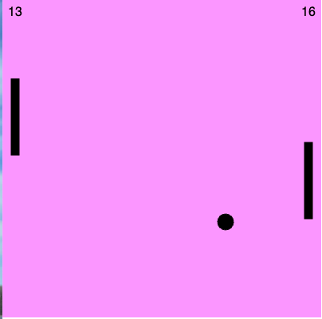

# Paddle Game
## Overview
Paddle Game is a simple and interactive JavaScript-based game that allows two players to engage in a competitive paddle duel. The game is designed to be straightforward, with player controls and scores displayed for easy interaction.

## How to Play
The game involves two players, each with their own controls:

Player 1:

Move Up: Press 'W'
Move Down: Press 'S'

Player 2:

Move Up: Press 'UP_ARROW'
Move Down: Press 'DOWN_ARROW'

The objective is to maneuver your paddle to hit the bouncing ball and prevent it from passing your side of the screen.

## Scores
The scores of each player are displayed at the top of the screen. The numbers are updated automatically as players score points during the game.

## Getting Started
1. Clone the repository: 
    git clone https://github.com/Lilycomeon/paddle-game
2. Open the index.html file in your web browser.
3. Start playing the game with a friend using the designated controls.

## Technologies Used
JavaScript

## Game Preview

## License
This project is licensed under the [MIT License](LICENSE.txt). For a detailed overview of the terms and conditions, please refer to the [LICENSE.txt](LICENSE.txt)

## Acknowledgments
Thanks to Pink Programming and Tarsier for inspiration or assistance with certain features.

Enjoy the Paddle Game! 🏓
